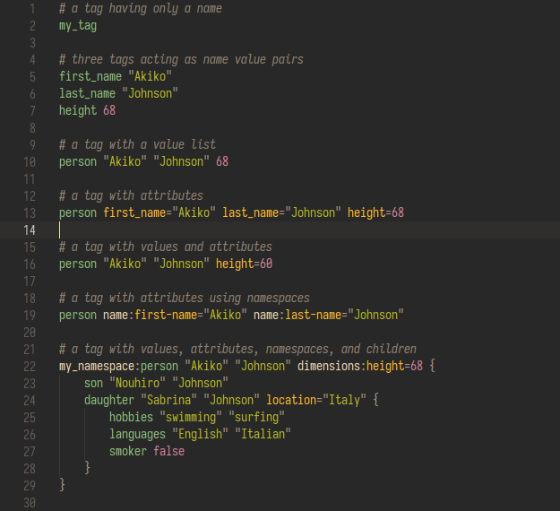

# SDLang for Visual Studio Code

This extension adds syntax highlighting for SDLang (`.sdl`) files, notably used
by the Dub package manager.

## Screenshot

Color scheme used in this screenshot is Gruvbox Dark Medium.

## Known Issues

Currently, this extension does not support dates, datetimes, or time spans.
